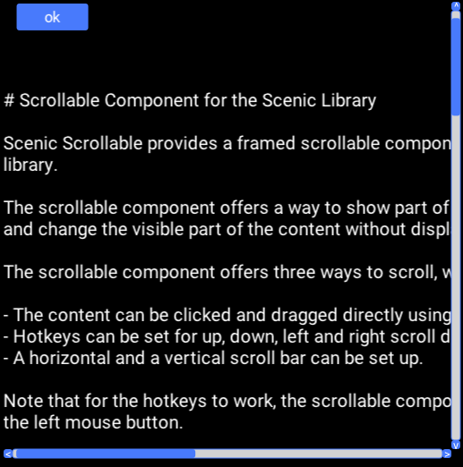
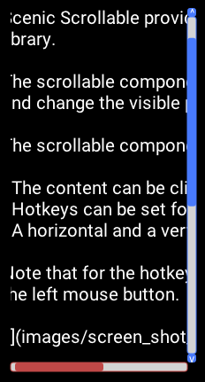

# Scrollable Component for the Scenic Library

Scenic Scrollable provides a framed scrollable component for the [Scenic](https://hex.pm/packages/scenic) library.

The scrollable component offers a way to show part of a content group bounded by a fixed rectangle or frame, and change the visible part of the content without displacing the bounded rectangle by scrolling.

The scrollable component offers three ways to scroll, which can be used in conjunction:

- The content can be clicked and dragged directly using a mouse.
- Hotkeys can be set for up, down, left and right scroll directions.
- A horizontal and a vertical scroll bar can be set up.

Note that for the hotkeys to work, the scrollable component has to catch focus first by clicking it once with the left mouse button.



## Getting Started

Install and setup [Scenic](https://hex.pm/packages/scenic).
Make a new project using the following command.

```
$ mix archive.install hex scenic_new
```

Add the following dependency to your mix.exs file.

```
{:scenic_scrollable, "~> 0.1"}
```

And pull the depencency.

```
$ mix deps.get
```

You can add a scrollable component to a graph by using `Scenic.Scrollable.Components.scrollable/4`.

## Examples

```
graph = Scenic.Scrollable.Components.scrollable(
  Scenic.Graph.build(),
  %{
    frame: {200, 400},
    content: %{x: 0, y: 10, width: 200, height: 800}
  },
  fn graph ->
    {:ok, text} = File.read("README.md")
    Scenic.Primitives.text(graph, text)
  end,
  [
    id: :scrollable_component_1,
    vertical_scroll_bar: []
  ]
)
```


```
graph = Scenic.Scrollable.Components.scrollable(
  Scenic.Graph.build(),
  %{
    frame: {200, 400},
    content: %{x: 0, y: 10, width: 400, height: 800}
  },
  fn graph ->
    {:ok, text} = File.read("README.md")
    Scenic.Primitives.text(graph, text)
  end,
  [
    scroll_position: {-10, -50},
    scroll_acceleration: %{
      acceleration: 15,
      mass: 1.2,
      counter_pressure: 0.2
    },
    scroll_hotkeys: %{
      up: "w",
      down: "s",
      left: "a",
      right: "d"
    },
    scroll_fps: 15,
    scroll_drag: %{
      mouse_buttons: [:left]
    },
    scroll_bar_thickness: 15,
    horizontal_scroll_bar: [
      scroll_buttons: false,
      scroll_bar_theme: Scenic.Primitive.Style.Theme.preset(:danger)
    ],
    vertical_scroll_bar: [
      scroll_buttons: true,
      scroll_bar_theme: Scenic.Primitive.Style.Theme.preset(:primary)
    ],
    translate: {50, 50},
    id: :scrollable_component_2
  ]
)
```



## Links

- [Documentation](https://hexdocs.pm/scenic_scrollable/Scenic.Scrollable.html)
- [GitHub](https://github.com:nanaki04/scenic_scrollable.git)
- [Scenic](https://hex.pm/packages/scenic)

## Contributing

Contributions are welcome. If there is anything you would like to improve or add, please open a ticket in the GitHub repository and we can discuss how to proceed.

### Setting up a production environment

Make sure you have the necessary dependencies to run [Scenic](https://hex.pm/packages/scenic).
Clone the [Scenic Scrollable](https://github.com/nanaki04/scenic_scrollable) repository.
Download all dependencies: `$ mix deps.get`.
You can run the demo scene to see any of the changes or additions you have made in action:

```
$ iex -S mix
```

You can adjust the demo scene to your needs. It is located at: `lib/scenes/demo.ex`

### Submitting a pull request

Before submitting a pull request please do the following checks:

- The demo is not broken `$ iex -S mix`
- Dialyzer is happy `$ mix dialyzer`
- All tests are green `$ mix test`
